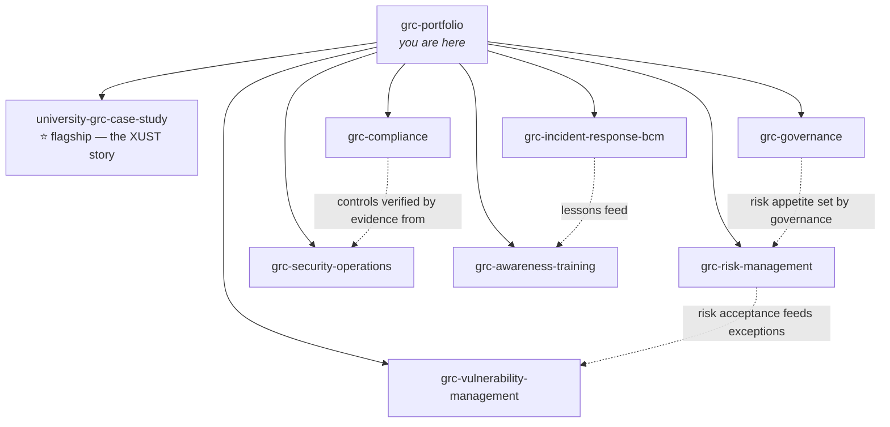

# The GRC Campus — Chris 

**Senior GRC Analyst | Fractional CISO | CISSP | ISO 27001 Lead Implementer**

This portfolio demonstrates the full Governance, Risk & Compliance lifecycle (from board-level strategy to packet-level evidence) built and tested in one of the most regulation-dense environments that exists: South African higher education.

I organised it around one belief:

```
┌──────────────────────────────────────────────────────────────────────┐
│  Templates show you know the format.                                 │
│  Completed work shows you can do the job.                            │
│  Defended decisions show you can survive the audit.                  │
│                                                                      │
│  This portfolio contains all three — for every artefact.             │
└──────────────────────────────────────────────────────────────────────┘
```

> **Disclaimer:** Artefacts marked `production-tested` were used in real engagements (anonymised and fictionalised so that no client data appears anywhere in this portfolio). Artefacts marked `demonstrative` were built to portfolio standard to show methodology. The distinction stays visible because honest labelling is itself a GRC control.

---

## ⏱ Quick tour (5 minutes)

1. **[The University as a Compliance Microcosm](https://github.com/YOURHANDLE/university-grc-case-study)** — one institution, six regulatory regimes (ISO 27001, POPIA, PAIA, GDPR, PCI DSS, HIPAA-benchmark), one student record traced through all of them
2. **[Risk Acceptance: Template + Worked Example + The Meeting Where It Was Challenged](https://github.com/YOURHANDLE/grc-risk-management)** — how a legacy-system risk actually gets accepted, and defended
3. **[Oracle Audit Vault Replacement](https://github.com/YOURHANDLE/grc-security-operations)** — Wazuh + Oracle Unified Auditing architecture that eliminated a six-figure annual licence cost. Policy → procedure → detection rule, end to end.

---

## How every artefact in this portfolio is structured

Most GRC portfolios i have reviewed have blank templates and I find it lacking. So, to the best of my ability, every major artefact here ships as a **trio**:

```
artefact/
├── template.md        # Reusable — take it, adapt it, it's yours (CC BY-SA)
├── worked-example.md  # Fully completed against a realistic scenario
└── decision-record.md # The judgment layer:
                       #   • The constraint I was working under
                       #   • The options I rejected, and why
                       #   • The decision I had to defend
                       #   • Anticipated challenges (auditor / QSA /
                       #     Information Regulator / Council) — and my answers
                       #   • Where my own argument is weakest
```

The third file is the one that matters in an interview. Anyone can download a template. The decision record is the part AI can't fake and juniors can't write.

---

## One universe, eight repositories

Instead of disconnected fictional companies, every scenario in this portfolio takes place at **XUST** — a fictional composite South African university. Its constraints are stated once and honoured everywhere:

```
┌──────────────────────────── XUST AT A GLANCE ────────────────────────────┐
│                                                                          │
│  31,000 students · 3,400 staff · 7 semi-autonomous faculties             │
│  Public HEI → subject to PAIA, POPIA, King IV expectations               │
│  Campus clinic (special personal information) · Card payments (PCI)      │
│  International students (GDPR exposure) · Research data · Residences     │
│  IT security headcount: 4. Security budget: a rounding error.            │
│  Political reality: faculties answer to Deans before they answer to IT.  │
│                                                                          │
└──────────────────────────────────────────────────────────────────────────┘
```

Why a university? 

Because it is a federation, a payment processor, a healthcare provider, a research institution, a landlord, a public body, and an ISP for 30,000 users who change every year. **GRC that works at XUST works anywhere.** That is the thesis of this portfolio — and because it is one universe, the SoA in the compliance repo references the same risk register that drives the vulnerability exceptions in the VM repo. The artefacts interlock the way they do in a real organisation.



---

## Repositories

| Repo | The decision it defends | Status |
|---|---|---|
| [university-grc-case-study](https://github.com/YOURHANDLE/university-grc-case-study) | How six regulatory regimes are run as one programme, not six projects | ⭐ Flagship |
| [grc-governance](https://github.com/YOURHANDLE/grc-governance) | What Council actually needs to see — and what it doesn't (King IV ↔ NIST CSF ↔ ISO 27001) | Production-tested |
| [grc-risk-management](https://github.com/YOURHANDLE/grc-risk-management) | When accepting a risk is the right call — and how to write it so it survives scrutiny | Production-tested |
| [grc-compliance](https://github.com/YOURHANDLE/grc-compliance) | Which Annex A controls to exclude, and defending the exclusions (risk-driven SoA) | Mixed |
| [grc-vulnerability-management](https://github.com/YOURHANDLE/grc-vulnerability-management) | Why some vulnerabilities don't get patched — exception governance done properly | Production-tested |
| [grc-security-operations](https://github.com/YOURHANDLE/grc-security-operations) | Replacing a commercial audit platform with open source — and proving equivalence | Production-tested |
| [grc-incident-response-bcm](https://github.com/YOURHANDLE/grc-incident-response-bcm) | Notify or not? POPIA s22 vs GDPR Art. 33 decision tree, plus the tabletop that tests it | Production-tested |
| [grc-awareness-training](https://github.com/YOURHANDLE/grc-awareness-training) | Why role-based beats annual-everyone training — with the measurement to back it | Demonstrative |

---

## GRC to glass

Most GRC professionals stop at the procedure. Most engineers never read the policy. The security-operations repo demonstrates the full vertical for selected controls:

```
  POLICY            "Privileged database activity shall be logged and
     │               independently reviewed."  (Council-approved)
     ▼
  PROCEDURE         Oracle Unified Auditing configuration standard +
     │               review cadence + escalation path
     ▼
  IMPLEMENTATION    Wazuh decoder & rules for Oracle audit trail;
     │               auditd rules for privileged OS users; syslog-TLS
     ▼
  EVIDENCE          Sample alert → triage record → audit-ready log,
                     mapped back to ISO 27001 A.8.15 / NIST CSF DE.AE
```

If you can't trace your control from the boardroom to the log line, you don't control it — you describe it.

---

## Senior signals — how I work

- **Constraints stated up front.** Every scenario names its budget, headcount, deadline, and political reality before any artefact appears. Trade-offs without constraints are theatre.
- **Exclusions documented as carefully as inclusions.** What I scoped out, what I didn't patch, what I declined to recommend — with reasoning.
- **Anticipated challenge built in.** Each decision record ends with the pushback I expect — from the auditor, the QSA, the Information Regulator, or the Council member who read one article about cyber — and my answer.
- **Where my argument is weakest.** Stated honestly in each decision record, because credibility compounds and bluffing doesn't survive audits.
- **Write once, brief twice.** Major artefacts ship in practitioner and executive registers. If you can't compress it for Council, you don't understand it yet.

---

## Beyond the artefacts

- 🎤 Conference presenter — NATE (South African university IT professionals): Wazuh security log analysis for resource-constrained institutions
- 🧭 Mentor to 120+ IT graduates into employment, with a focus on non-traditional candidates
- ✍️ Writing on the gap between governance on paper and governance in practice — [LinkedIn](#)

## Contact

**[LinkedIn](#)** · **[Email](#)** · Open to senior GRC, CISO, and advisory conversations — SA and international.

---

*All content anonymised and fictionalised. XUST is a fictional composite created for demonstration; any resemblance to a specific institution is coincidental. Templates licensed CC BY-SA 4.0 — take them, adapt them, ship them. If they help you, that's the point.*
